# 미국친구AI


> 카카오톡을 기반으로 대화를 통해 영어 공부를 할 수 있는 인공지능 챗봇 서비스


## ✍ 개요

> 영어 공부의 필요성은 느끼지만 시간적⏱ 여유가 부족하다....
>
> ⇒ 채팅 앱을 통해 영어 대화를 하며 틈틈이 공부하면 어떨까? 
>
> ⇒ 대화 기록을 통해 피드백을 제공하면 더 도움이 되지 않을까?


## 💻 기능 소개

- 미친AI와 대화하기
  - 카카오톡에서 `미국친구AI` 친구 추가 후, `대화하기` 클릭  
  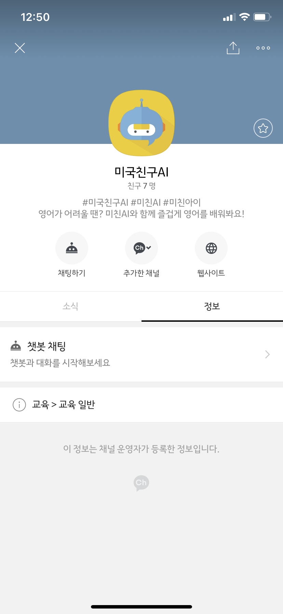
  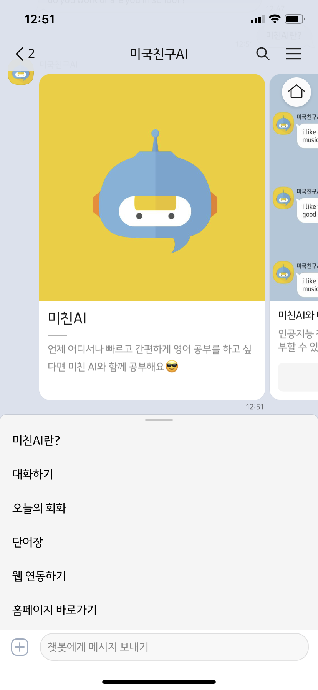

  - 홈페이지의 `채팅 기록` 탭에서 날짜 별 채팅 기록 확인 가능 
  
    - 형광펜 표시 위에 커서를 올리면 Spelling, Grammar 교정내역 표시
  
    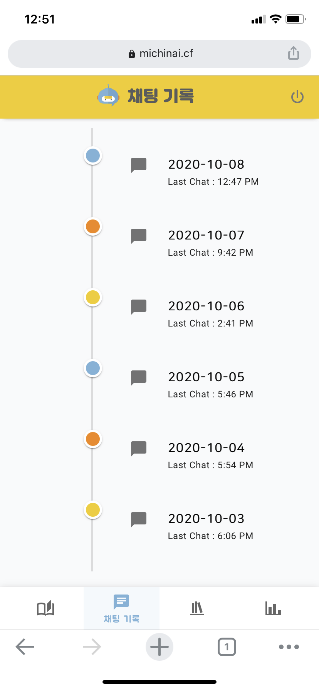
    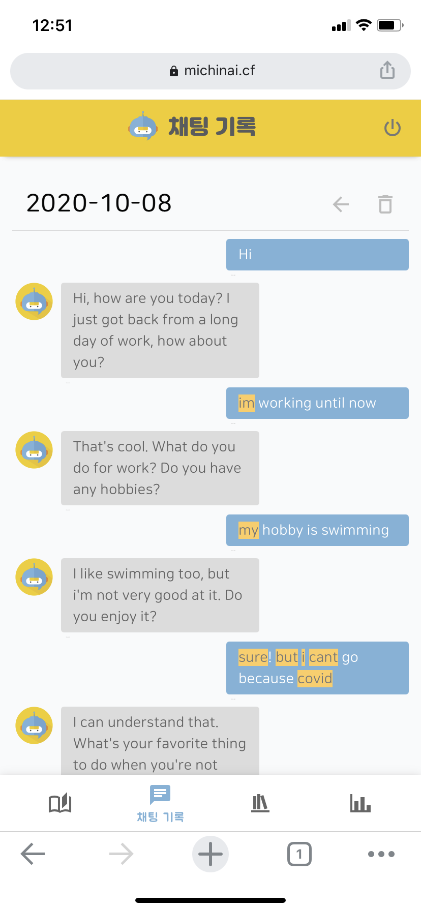
    
    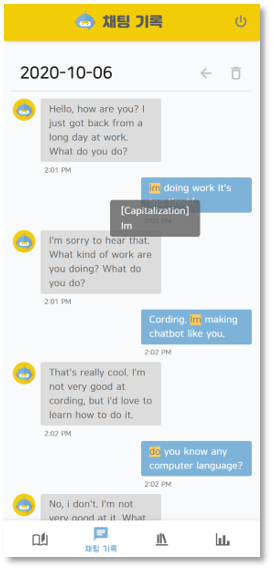
- 오늘의 회화
  - 네이버 크롤링을 통해, 1년 이내의 오늘의 회화를 통해 영어 회화 학습 가능
  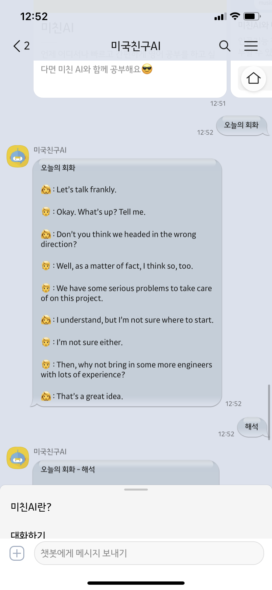
  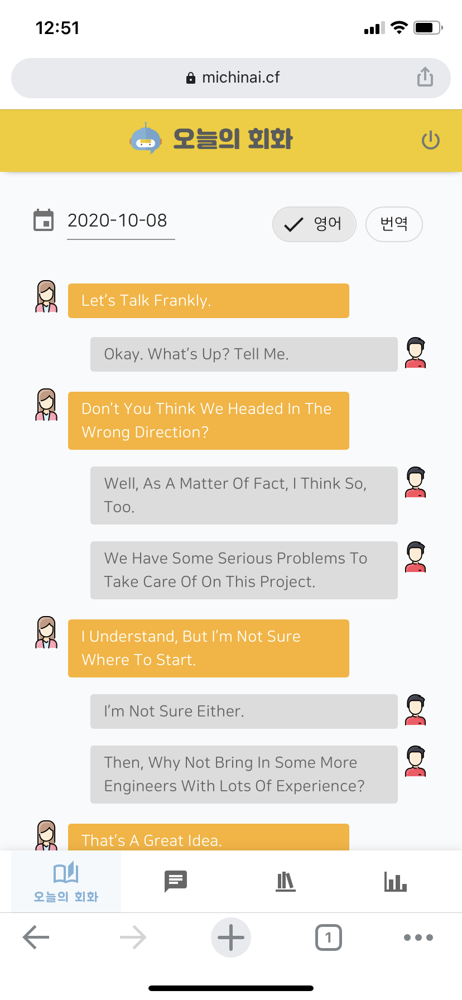
- 단어장
  - 기본 단어장 제공, 개인 단어장 생성 가능
  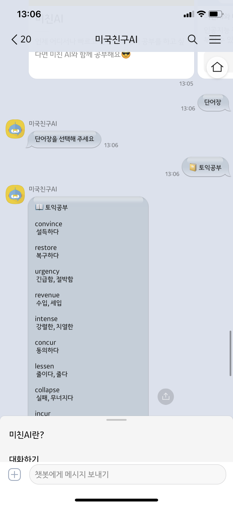
  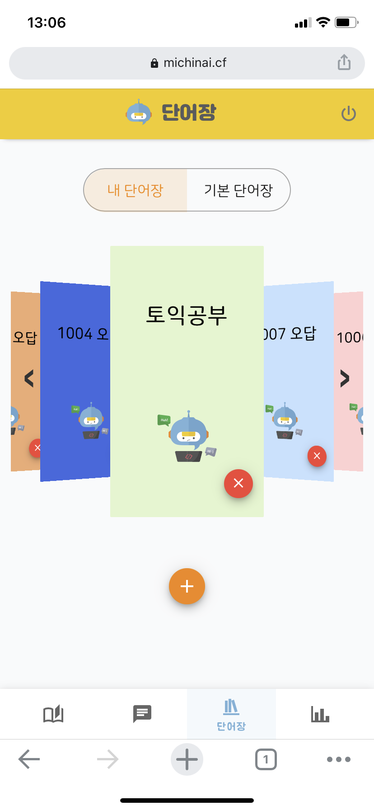
  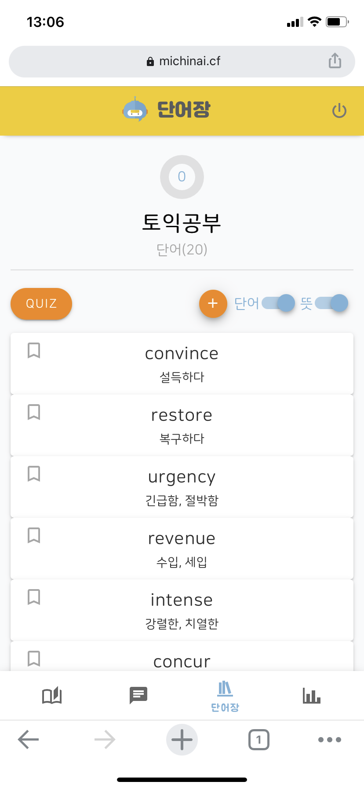  

  - 단어장 단어 기반으로 한 단어 퀴즈 제공
    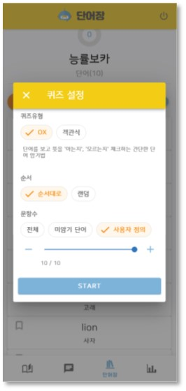
  
    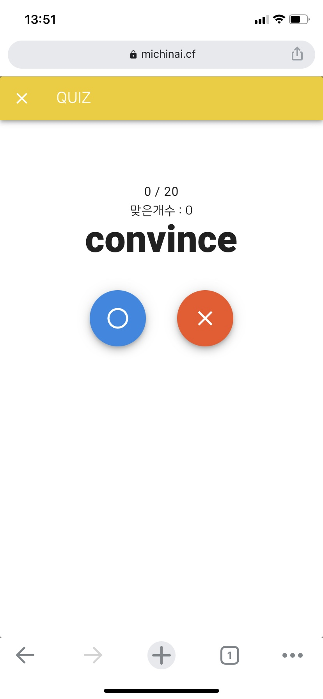
  
    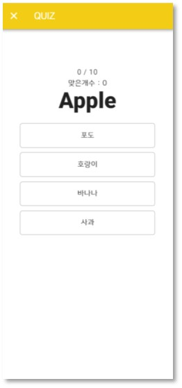
- 채팅 점수
  - 미친AI와의 대화에서 나타난 철자, 문법, 문맥 등의 오류를 통해 점수를 계산하여 동기 부여 효과를 제공
  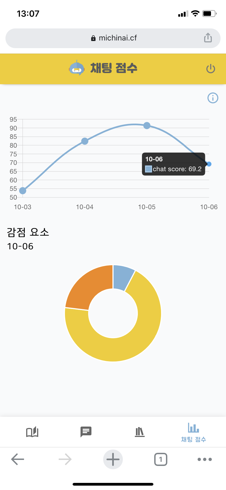


## 📊 기술 스택

### 개발 기간

- 2020.08.31 ~ 2020.10.08

### Front-End

- HTML/JS/CSS
- Vue.js/Vuetify

### Back-End

- Spring Boot

### Server & CI/CD

- Docker
- Jenkins
- NGINX

### DB

- MariaDB
- MongoDB

### ETC

- ParlAI
- LT (Language-Tool)
- Kakao i open builder
- Selenium


## 📝 기술 소개

- Kakao i open builder

  > 카카오톡 채널의 챗봇 설계가 가능한 카카오 AI 설계 플랫폼

- ParlAI

  >  챗봇 개발을 위한 대화 AI 모델의 공유, 훈련 및 테스트 환경을 제공하는 Framework

- LT (Language-Tool Open Source)

  > 영어 포함 20개 이상의 언어의 Spelling, Grammar 검사를 제공하는 Open Source


## 🔃데이터 전달방식

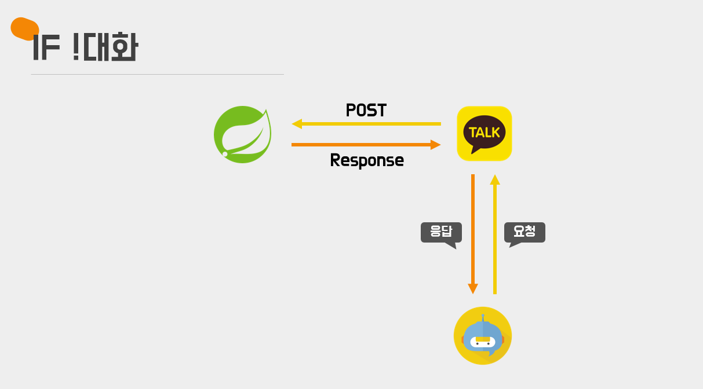

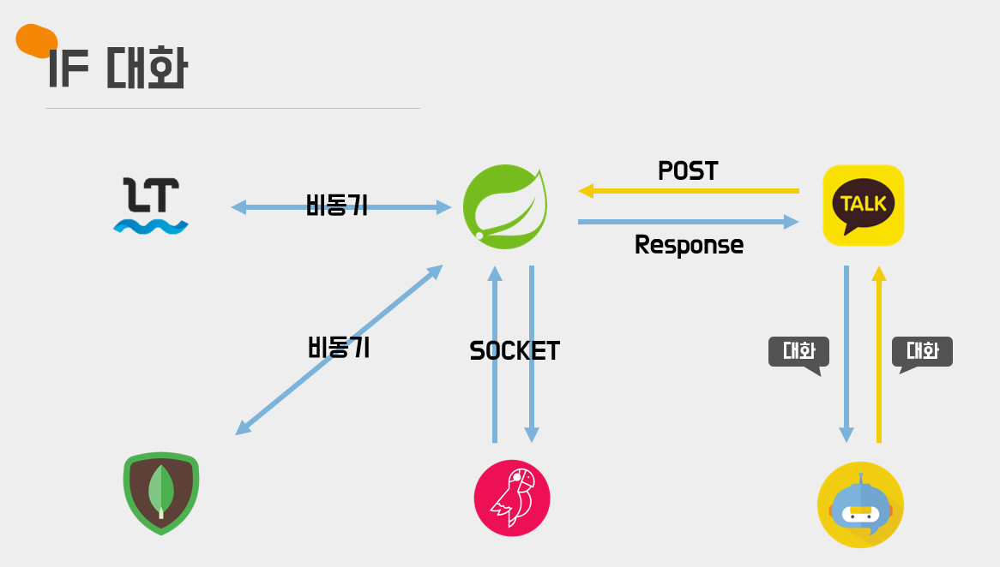

## 🎇 테스트 방법 (서비스 종료😥)

💥 테스트를 하기 위해

>1. 카카오톡에서 미국친구AI 친구 추가
>
>2. 홈페이지에서 회원가입 후 카카오톡의 `웹 연동하기`과정 필요


💥 미친AI가 궁금하다면?

> 1. 카카오톡에서 '미국친구AI'와 채팅하기
>
> 2. https://michinai.cf 방문하기


## 📌 실행 방법

```
$ cd ./frontend
$ npm install
$ npm run build

$ cd ../backend
$ mvn clean package
$ nohup java -jar MichinAI-0.0.1-SNAPSHOT.jar &
```

